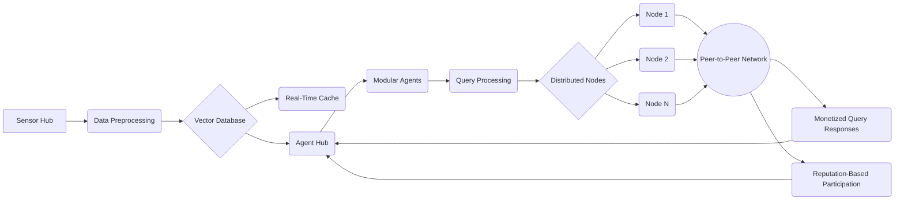

# Systems Architecture

## Overview
The Loreum Network's architecture is designed to support a decentralized, autonomous ecosystem where human and AI agents collaborate seamlessly. Below is an in-depth look at its core components:

## Loreum Node
A Loreum Node is a modular, decentralized unit that serves as the foundation of the Loreum Network. Each node is designed to operate autonomously while contributing monetizable data and intelligence to the broader network.

### 1. Data Processing and Storage
- Collecting, processing, and storing data from local and external sources
- Leveraging both real-time streaming and fetch-requested data pipelines for seamless integration

### 2. Retrieval-Augmented Generation (RAG) Capability
- Equipped with a RAG vector database for storing and retrieving contextually relevant information
- Enhancing decision-making by combining historical knowledge with real-time data

### 3. Sensor and Agent Integration
- Acting as a hub for the Sensor Hub, responsible for gathering, processing, and contextualizing data inputs
- Hosting the Agent Hub, where human and AI agents collaborate to perform specialized tasks

### 4. Autonomy and Collaboration
- Operating independently with local governance and resource management
- Collaborating with other nodes by sharing data and insights, governed by a monetized query exchange system

### 5. Reputation System
- Each node's trustworthiness and performance are measured through a reputation mechanism
- High-performing nodes gain more queries, governance influence, and rewards within the network

## Sensor Hub
The **Sensor Hub** is responsible for:
- Gathering real-time data from various sources.
- Processing fetch-requested data for on-demand needs.
- Serving as the data ingestion and processing layer of the network.

## Agent Hub
The **Agent Hub** facilitates:
- Adding and managing various agents to perform specific tasks and functions.
- Enabling modular and extensible development of network functionalities.
- Supporting collaboration between human and AI agents.

## Data Flow 

#### 1. Data Ingestion
- **Sensor Hub:**
  - Serves as the data ingestion layer, collecting information from multiple sources, such as APIs, IoT devices, blockchain events, or user-provided inputs.
  - **Real-Time Streams:** Processes real-time data streams using WebSocket APIs or event-based triggers, enabling instant updates.
  - **Batch and Fetch Requests:** Handles periodic or on-demand data requests via APIs, ensuring data completeness.
  - **Preprocessing:** Applies data cleaning, normalization, and format conversions to prepare data for downstream tasks.

- **Data Storage:**
  - **Vector Database:** Stores structured and unstructured data in an optimized format for AI retrieval, enabling semantic search and context-rich insights.
  - **Real-Time Cache:** A fast-access storage layer (e.g., Redis) for frequently queried data, improving responsiveness for time-sensitive operations.

#### 2. Agent Interaction
- **Agent Hub:**
  - Acts as the execution layer where modular agents interact with ingested data to perform specific tasks or generate insights. Each agent is designed for a unique function, such as trading, analytics, or governance.
  - **Dynamic Querying:** Agents dynamically query the vector database using natural language or structured queries, leveraging the Haystack AI pipeline for retrieval-augmented generation (RAG).

#### 3. AI Pipeline Integration
- **Document Retrieval:**
  - Employs a dense retrieval system using embeddings to identify relevant documents, streams, or data fragments based on semantic similarity.
  - Implements retrieval models like DPR (Dense Passage Retrieval) or BM25 for relevance scoring.

- **Question Answering:**
  - Agents issue queries in natural language, and the pipeline uses the vector database to return contextually relevant data.
  - The pipeline supports extractive (finding exact answers in text) and generative (providing synthesized answers) capabilities.

- **Indexing and Embedding Creation:**
  - Data ingested through the Sensor Hub is tokenized and embedded into high-dimensional vectors.
  - Updates occur in real-time or on schedule, ensuring the index remains fresh and relevant.

- **Pipeline Stages:**
  - **Preprocessor:** Cleans and splits data into smaller chunks for efficient indexing.
  - **Retriever:** Selects the most relevant chunks of data.
  - **Reader:** Extracts specific information from retrieved chunks or generates detailed answers.
  - **Generator:** (Optional) Provides synthesized and contextual responses for complex queries.

#### 4. Data Processing Workflow
1. **Input Handling:**
   - Incoming data is categorized into streams, batches, or on-demand requests.
   - NLP preprocessing, entity recognition, or sentiment analysis can be applied as needed.

2. **Knowledge Base Updates:**
   - Parsed data is indexed into the vector database, enabling enhanced retrieval capabilities.
   - Metadata (e.g., timestamps, tags) is added to enrich query results and contextual relevance.

3. **Agent Execution:**
   - Agents leverage the pipeline to access and process data.
   - **Example:**
     - A DeFi trading agent queries price data and historical trends for market predictions.
     - A supply chain agent fetches IoT sensor data to optimize logistics in real-time.

4. **Result Delivery:**
   - Responses are routed back to users or other systems through the Agent Hub.
   - Feedback loops allow agents to refine tasks or request additional data iteratively.

## The Network

1. **Distributed Architecture**
   - **Nodes as Independent Entities:**
     - Each node represents a Loreum Node, which contains its own vector database, indexing relevant data.
     - Nodes are autonomous and can manage their own ingestion, storage, and processing pipelines.
     - A node’s data and embeddings are tailored to its specific purpose, whether domain-specific (e.g., finance, healthcare) or general.
   - **Interconnected Nodes:**
     - Nodes are interconnected through a peer-to-peer network.
     - When a query is issued, the network collaboratively identifies the most relevant nodes based on metadata, reputation scores, or expertise.

2. **Data Storage and Indexing Across Nodes**
   - **Federated Vector Databases:**
     - Each node maintains a vector database that stores embeddings created from its local dataset.
     - The distributed structure ensures no single point of failure, and nodes can index both structured and unstructured data (e.g., documents, IoT data, APIs).
     - Data redundancy and synchronization ensure robustness while maintaining autonomy for nodes.
   - **Localized Indexing:**
     - Nodes only index data that is relevant to their specialized domain.
     - This localized indexing improves retrieval efficiency and reduces unnecessary data sharing across the network.

3. **Query Execution in a Distributed System**
   - **Query Routing:**
     - A query is routed to relevant nodes based on metadata tags, vector similarities, or domain-specific reputation scores.
     - The querying node either broadcasts the query to all nodes or sends it to a select few based on pre-defined criteria.
   - **Semantic Search Across Nodes:**
     - Nodes use their local vector database to retrieve relevant documents or embeddings.
     - Results from multiple nodes are aggregated and ranked to ensure the highest-quality response.
   - **Parallel Processing:**
     - Queries can be processed in parallel across nodes, significantly reducing response time.
     - This parallelism enables scalability, as additional nodes enhance processing power rather than bottleneck it.

4. **Collaboration and Monetization**
   - **Monetized Query Responses:**
     - Nodes can monetize their contributions by charging for responses, creating an economic incentive to participate in the network.
     - Payment mechanisms (e.g., microtransactions via blockchain) ensure fair compensation based on contribution.
   - **Reputation-Based Participation:**
     - Nodes with higher-quality responses and consistent reliability are rewarded with more queries, incentivizing good behavior and accurate data management.

5. **Enhancing RAG’s Capabilities with Distributed Nodes**
   - **Data Diversity:**
     - A distributed network allows RAG to access a broader spectrum of data sources.
     - For example, one node might specialize in financial data while another focuses on medical research.
   - **Scalability:**
     - As the network grows, new nodes can be added without disrupting the overall architecture.
     - Each node strengthens the collective intelligence of the network.
   - **Fault Tolerance and Decentralization:**
     - The system does not rely on a single central server. If one node fails, others can handle the workload, ensuring uninterrupted service.

6. **Real-World Example**
   - Imagine a decentralized RAG network where:
     - A user queries for blockchain analytics.
     - The query is routed to nodes specializing in blockchain, each processing their local dataset.
     - Responses are aggregated into a coherent result, leveraging insights from multiple sources.
     - The user pays a small fee distributed among the contributing nodes.

