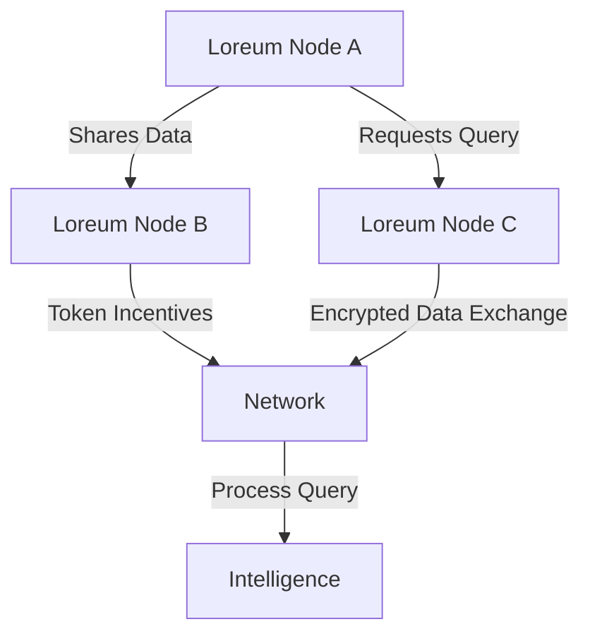

  

# Overview

The Loreum Network is a decentralized super-intelligence ecosystem designed to enable seamless collaboration between human and AI agents. With a focus on fostering innovation, inclusivity, and sustainability, the network leverages distributed AI services and collaborative decision-making to create a secure and interoperable platform. Its vision is to democratize access to advanced technologies and data, empowering individuals and communities to innovate and govern responsibly.

At the core of the Loreum Network's architecture are the concepts of open protocols, distributed control, and token economics.
Open protocols ensure interoperability and seamless integration between different components within the network. Distributed
control promotes resilience by eliminating single points of failure and ensuring data sovereignty through decentralized
storage and processing. Token economics incentivize participation and contribution to the network, fostering a self-sustaining
ecosystem.

The network's infrastructure comprises key elements such as the Sensor Hub, Agent Hub, and the Retrieval-Augmented Generation
(RAG) contextualization database. The Sensor Hub is responsible for ingathering and preprocessing data from various sources in
real-time, acting as the eyes and ears of the system. The Agent Hub facilitates the management and deployment of AI agents
that perform specific tasks within the network, such as executing smart contracts or providing analytical insights.

The governance model is facilitated by a reputation system and token-based incentives. The reputation system evaluates nodes based on their performance and reliability, influencing their ability to attract queries and earn rewards. This ensures that the network maintains high standards and reliability, fostering trust among users.

The potential applications of the Loreum Network span across various industries, including finance, healthcare, education,
marketing, and more. By enabling decentralized AI services, data monetization, and collaborative decision-making, the network
opens up a plethora of opportunities for innovation and cross-industry collaboration.

---

## What is the Loreum Network?

The Loreum Network is built to empower decentralized intelligence and decision-making. By combining data, sensors, agents, and governance in a modular architecture, it creates a dynamic and flexible system for innovation. Its core design principles include:

- **Autonomy**: Each Loreum Node acts as an independent unit, managing its own data and decision-making processes.
- **Collaboration**: Nodes interact and exchange resources within a unified protocol, fostering interoperability.
- **Economic Incentives**: A tokenized system incentivizes contributions and ensures fair value distribution.

### Core Features
- **Distributed Governance**: Decision-making is powered by token delegation and reputation systems.
- **Modular Architecture**: Nodes can add sensors, agents, and custom extensions.
- **Monetized Queries**: Nodes earn tokens for responding to external requests or sharing data.
- **Privacy and Security**: Data exchanges are encrypted, and nodes operate under a decentralized consensus protocol.

---

## High-Level Architecture

Here’s a visual representation of the Loreum Network’s architecture:

### Components
1. **Loreum Nodes**:
   - Autonomous units managing local data, sensors, and agents.
   - Capable of interacting with other nodes for resource sharing and collaboration.

2. **Governance System**:
   - A decentralized framework based on token delegation.
   - Ensures decisions align with the network’s collective goals.

3. **Leaderboard**:
   - A dynamic system ranking nodes based on contributions and reputation.
   - Nodes with higher ranks have more influence within the network.

---

## Key Benefits

1. **Decentralized Innovation**:
   - Enables participants to create and expand applications without central oversight.

2. **Equitable Participation**:
   - Democratizes access to powerful AI tools and governance systems.

3. **Scalable Collaboration**:
   - Nodes can seamlessly join or leave the network, ensuring continuous evolution.

4. **Enhanced Security**:
   - Decentralized architecture minimizes risks of single points of failure.

---

## Get Started

Explore the documentation to learn more about:
- [Setup Guide](guides/setup/local-installation.md): Install and configure your first Loreum Node.
- [API Reference](api/overview.md): Integrate with Loreum using its robust APIs.

We’re excited to see how you contribute to the Loreum Network and shape the future of decentralized systems!
