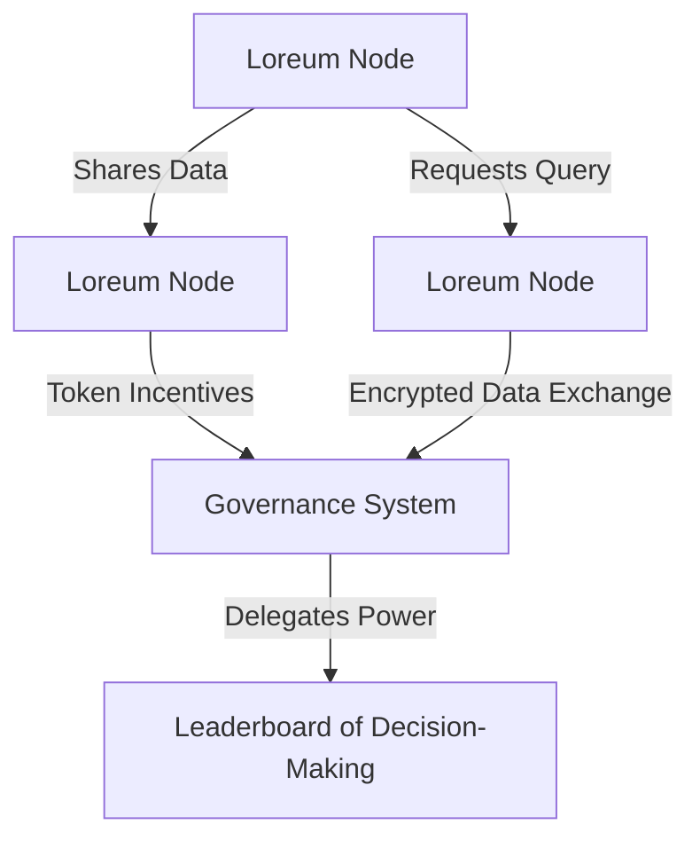

  

# Overview

Welcome to the **Loreum Network** documentation! Loreum is a decentralized, autonomous system designed to coordinate human and AI agency within a secure, scalable, and collaborative ecosystem. Each node in the network, called a **Loreum Node**, operates independently while contributing to the broader network's governance, innovation, and economic sustainability.

---

## What is the Loreum Network?

The Loreum Network is built to empower decentralized intelligence and decision-making. By combining data, sensors, agents, and governance in a modular architecture, it creates a dynamic and flexible system for innovation. Its core design principles include:

- **Autonomy**: Each Loreum Node acts as an independent unit, managing its own data and decision-making processes.
- **Collaboration**: Nodes interact and exchange resources within a unified protocol, fostering interoperability.
- **Economic Incentives**: A tokenized system incentivizes contributions and ensures fair value distribution.

### Core Features of Loreum:
- **Distributed Governance**: Decision-making is powered by token delegation and reputation systems.
- **Modular Architecture**: Nodes can add sensors, agents, and custom extensions.
- **Monetized Queries**: Nodes earn tokens for responding to external requests or sharing data.
- **Privacy and Security**: Data exchanges are encrypted, and nodes operate under a decentralized consensus protocol.

---

## High-Level Architecture

Here’s a visual representation of the Loreum Network’s architecture:

### Components:
1. **Loreum Nodes**:
   - Autonomous units managing local data, sensors, and agents.
   - Capable of interacting with other nodes for resource sharing and collaboration.

2. **Governance System**:
   - A decentralized framework based on token delegation.
   - Ensures decisions align with the network’s collective goals.

3. **Leaderboard**:
   - A dynamic system ranking nodes based on contributions and reputation.
   - Nodes with higher ranks have more influence within the network.

---

## Key Benefits

1. **Decentralized Innovation**:
   - Enables participants to create and expand applications without central oversight.

2. **Equitable Participation**:
   - Democratizes access to powerful AI tools and governance systems.

3. **Scalable Collaboration**:
   - Nodes can seamlessly join or leave the network, ensuring continuous evolution.

4. **Enhanced Security**:
   - Decentralized architecture minimizes risks of single points of failure.

---

## Get Started

Explore the documentation to learn more about:
- [Setup Guide](guides/setup/local-installation.md): Install and configure your first Loreum Node.
- [API Reference](api/overview.md): Integrate with Loreum using its robust APIs.

We’re excited to see how you contribute to the Loreum Network and shape the future of decentralized systems!
