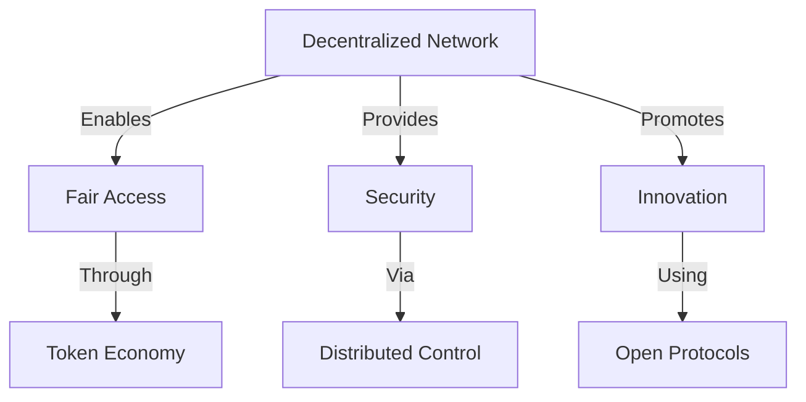

# Why Loreum?

Loreum is building a decentralized future where power is distributed, collaboration is incentivized, and innovation is democratized.

## The Problem

In today's data-driven world, centralization poses significant challenges:

1. **Monopolization**
   - Data and AI tools controlled by tech giants
   - Barriers for innovation and fair competition

2. **Security and Privacy Risks**
   - Centralized systems vulnerable to breaches
   - Misuse of sensitive information

3. **Limited Access**
   - Smaller businesses struggle with AI tools
   - Individuals lack access to advanced capabilities

## Our Solution

Loreum addresses these challenges through:

### Key Features
- Decentralized governance
- Token-based incentives
- Cross-industry applications
- Scalable architecture

## Market Opportunity

The demand for decentralized networks is growing across industries:
- AI and Data: $200B+ market by 2025
- IoT: Critical infrastructure needs
- DeFi: Growing financial ecosystem
- Healthcare: $100B+ by 2030

## Get Started

Ready to join the future of decentralized intelligence? 
[Start building](getting-started.md) with Loreum today.

