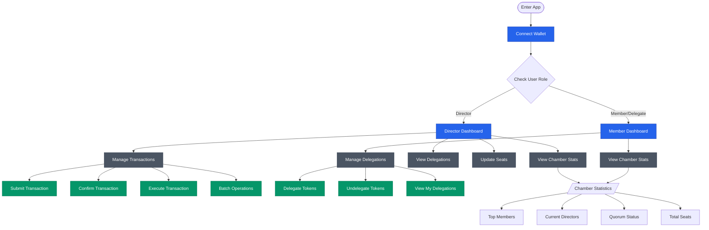

```mermaid
flowchart TD
    Start([Enter App]) --> Auth[Connect Wallet]
    
    Auth --> CheckRole{Check User Role}
    CheckRole -->|Director| DirectorView[Director Dashboard]
    CheckRole -->|Member/Delegate| MemberView[Member Dashboard]
    
    %% Director Flow
    DirectorView --> D1[View Chamber Stats]
    DirectorView --> D2[Manage Transactions]
    DirectorView --> D3[View Delegations]
    DirectorView --> D4[Update Seats]
    
    D2 --> D2a[Submit Transaction]
    D2 --> D2b[Confirm Transaction]
    D2 --> D2c[Execute Transaction]
    D2 --> D2d[Batch Operations]
    
    %% Member/Delegate Flow
    MemberView --> M1[View Chamber Stats]
    MemberView --> M2[Manage Delegations]
    
    M2 --> M2a[Delegate Tokens]
    M2 --> M2b[Undelegate Tokens]
    M2 --> M2c[View My Delegations]
    
    %% Shared Views
    M1 --> SharedStats[/Chamber Statistics/]
    D1 --> SharedStats
    
    SharedStats --> S1[Top Members]
    SharedStats --> S2[Current Directors]
    SharedStats --> S3[Quorum Status]
    SharedStats --> S4[Total Seats]
    
    %% Styling
    classDef primary fill:#2563eb,stroke:#1e40af,color:white
    classDef secondary fill:#4b5563,stroke:#374151,color:white
    classDef action fill:#059669,stroke:#047857,color:white
    
    class Auth,DirectorView,MemberView primary
    class D1,D2,D3,D4,M1,M2 secondary
    class D2a,D2b,D2c,D2d,M2a,M2b,M2c action
```